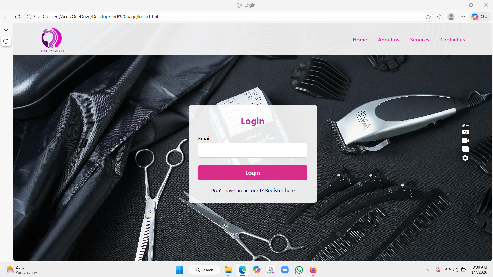
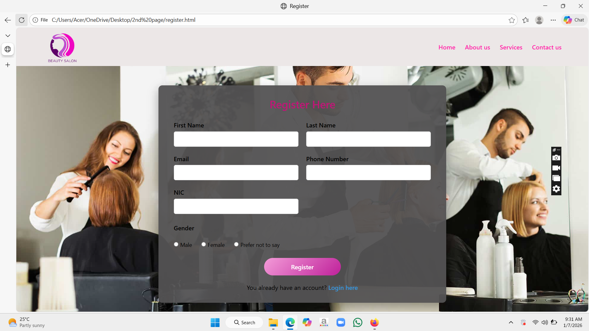
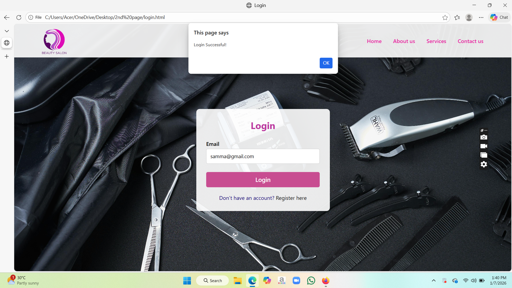
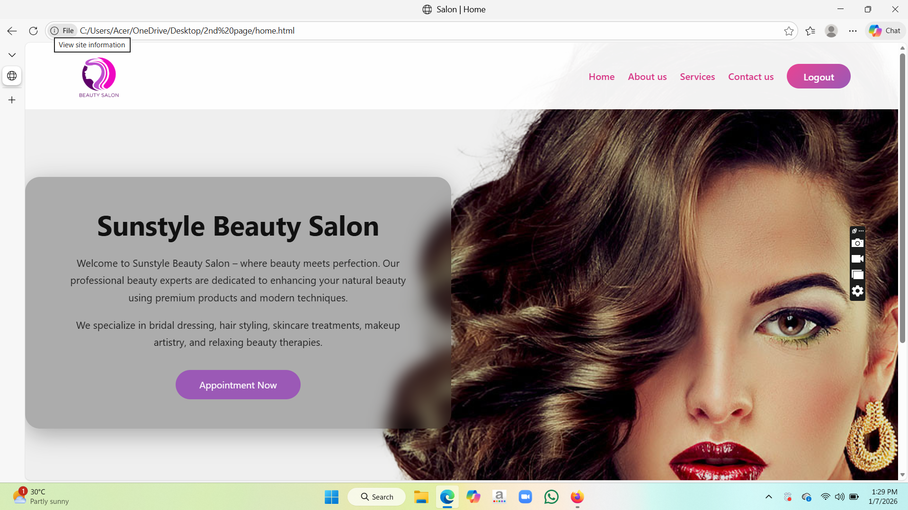
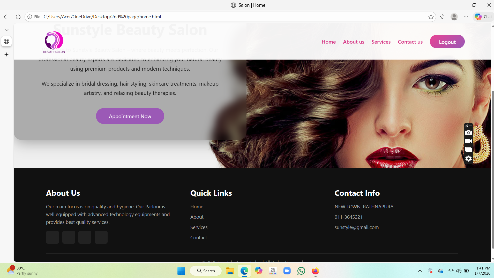
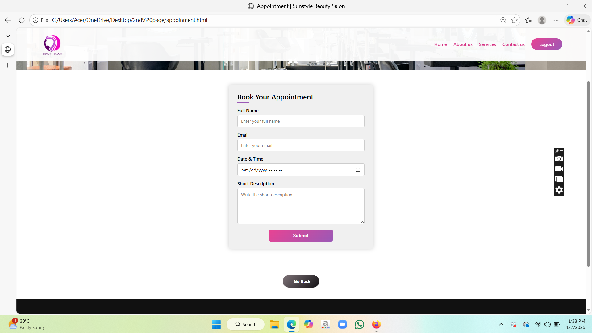
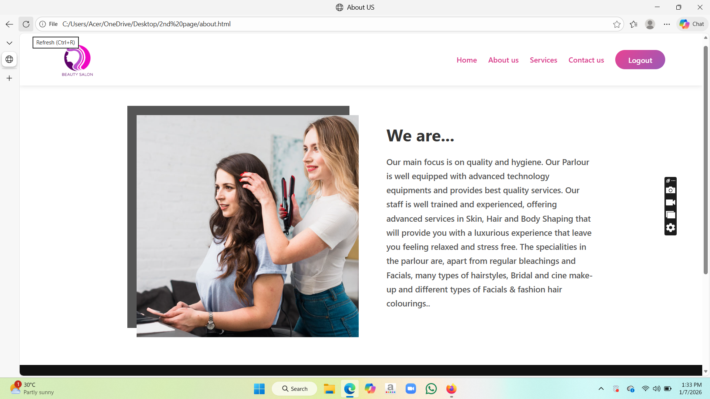
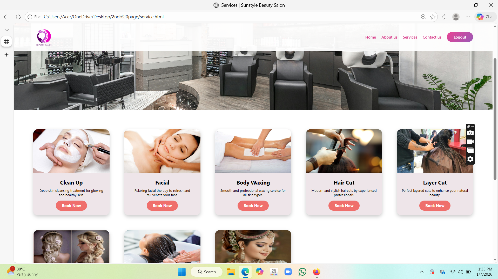
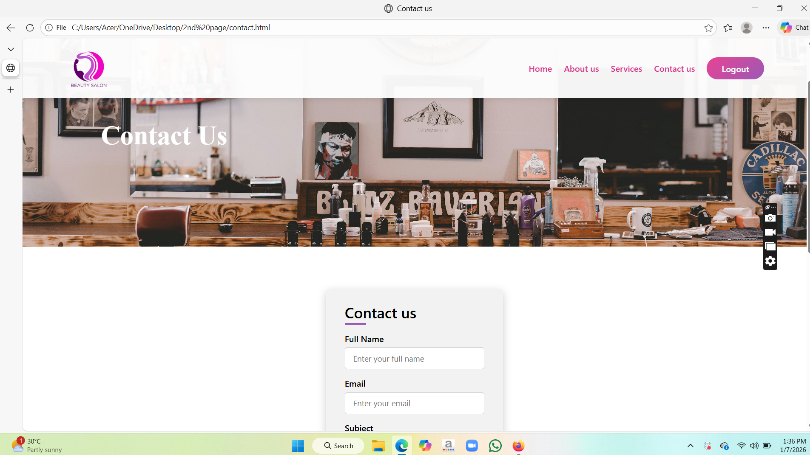
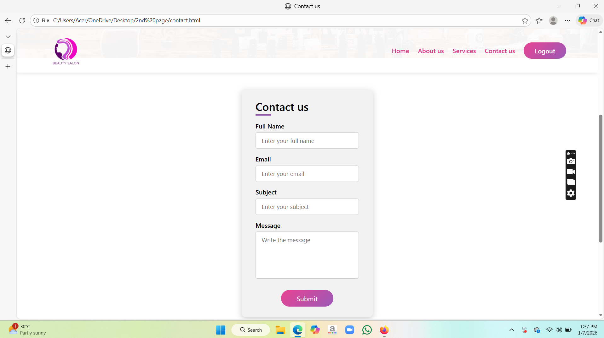

# 💇‍♀️ Salon Online Booking System

A salon web system that allows customers to book appointments online using HTML and CSS.

---

## 📌 Project Overview

This project is a simple and responsive salon website designed to allow customers to view salon services and book appointments online.  
It is developed as a web-based project using **HTML** and **CSS**.

---

## ✨ Features

- Home page with salon introduction
- About Us page
- Services display
- Online appointment booking form
- Contact Us page
- Responsive design
- Simple and user-friendly interface

---

## 🛠️ Technologies Used

- HTML 
- CSS 
- Font Awesome  

---

## 📂 Project Structure
---

## 🌐 Live Demo

If hosted using GitHub Pages, visit:
---

## 🚀 How to Use

1. Download or clone the repository
2. Open `login.html` in a web browser
3. Navigate through the website
4. Book an appointment using the booking form

---

## 👩‍💻 Author

- Name: Shaksarani Dharmasena  
- GitHub: https://github.com/sammadharmasena-eng

---

## 📄 License

This project is created for educational purposes.

## 📸 Screenshots

